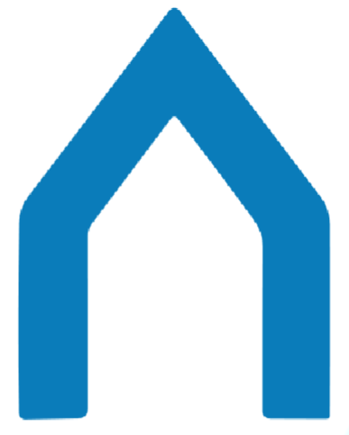

 

  

<h2 align="center">La ChaîNet</h2>

    WINNER OF MORGAN STANLEY CODE TO GIVE 2024 HACKATHON
     

## About The Project
La ChaîNet is a full-stack web application created for the non-profit Le Chaînon. The app provides a system for caregivers and residents to manage intevention plans and visualize related statistics. 

Caregivers have access to the following features:
* Caregiver dashboard with interactive data visualizations, upcoming/recent events, calendar with events and notes management for selected date
* Residents list with summarized and detailed views for each resident
* Intervention plan form to create a new plan for a resident
* Chat with assigned residents

Residents have access to the following pages:
* Resident dashboard with goal statistics visualizations, calendar showing events for selected date, upcoming/recent events, and sections to display/create/edit goals, treatment team and significant persons
* Resources page displaying curated resources related to the resident's situation
* Chat with assigned caregiver

### Screenshots

(<a href="#readme-top">back to top</a>)

### Built With

* [![React][React]][React-url]
* [![Python][Python]][Python-url]
* [![Firebase][Firebase]][Firebase-url]

(<a href="#readme-top">back to top</a>)

## License

Distributed under the MIT License. See `LICENSE.txt` for more information.

(<a href="#readme-top">back to top</a>)

## Acknowledgments

* [Material UI React Template](https://github.com/minimal-ui-kit/material-kit-react)
* [Flaticon Freepik Icons](https://www.flaticon.com/free-icons/planningcreated)

(<a href="#readme-top">back to top</a>)

[React]: https://img.shields.io/badge/React-000000?style=for-the-badge&logo=React
[React-url]: https://react.dev/
[Python]: https://img.shields.io/badge/Python-FFFFFF?style=for-the-badge&logo=Python
[Python-url]: https://www.python.org/
[Firebase]: https://img.shields.io/badge/Firebase-059BE5?style=for-the-badge&logo=Firebase
[Firebase-url]: https://firebase.google.com/
